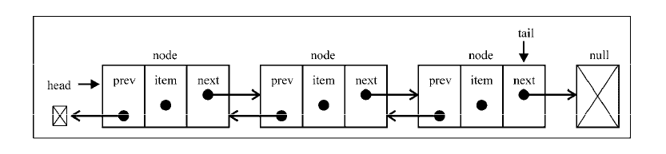

# 双向链表
双向链表是链表的一种，它和单向链表的区别是双向链表比单向链表每个节点多一个头指针，这个指针指向前一个节点，也就是说，每个节点包含包含头指针、存储元素、尾指针， 因此从这个节点可以同时访问到它前面和后面的节点。我们可以想一下，如果是单向链表，要访问一个节点前面的节点，是不是要从头结点开始遍历，直到找个这个节点前面的节点为止，而双向链表直接就可以访问前一个节点，查询和操作数据就会更加方便。世界上没有完美的东西，有利就有弊，方便了数据操作的同时，牺牲的是所占的空间，因为每个节点要多出一个头指针，必然会多占用一定的内存空间，这也是空间换时间的一种方式。



## 双向链表的javascript实现
我们还是用类的方式来实现数据结构，跟单向链表所提供的方法类似，双向链表的特殊之处在于插入和移除元素时对于头指针的操作。

```js
// 链表节点
class Node {
    constructor(element) {
        this.element = element;
        this.prev = null;
        this.next = null;
    }
}


class DoubleLinkedList {
    constructor() {
        this.head = null;
        this.length = 0;
        this.tail = null;
    }

    /*...*/

    // 任意位置插入元素
    insert(position, element) {
        if (position >= 0 && position <= this.length){
            const node = new Node(element)
            let current = this.head
            let previous = null
            let index = 0
            // 首位
            if (position === 0) {
                if (!head){
                    this.head = node
                    this.tail = node
                } else {
                    node.next = current
                    this.head = node
                    current.prev = node
                }
            // 末位
            } else if (position === this.length) {
                current = this.tail
                current.next = node
                node.prev = current
                this.tail = node
            // 中位
            } else {
                while (index++ < position) {
                    previous = current
                    current = current.next
                }
                node.next = current
                previous.next = node
                current.prev = node
                node.prev = previous
            }
            this.length++
            return true
        }
        return false
    }

    // 移除指定位置元素
    removeAt(position) {
        if (position > -1 && position < this.length) {
            let current = this.head
            let previous = null
            let index = 0

            // 首位
            if (position === 0) {
                this.head = this.head.next
                this.head.prev = null
                if (this.length === 1) {
                    this.tail = null
                }

            // 末位
            } else if (position === this.length - 1) {
                this.tail = this.tail.prev
                this.tail.next = null

            // 中位
            } else {
                while (index++ < position) {
                     previous = current
                     current = current.next
                }
                previous.next = current.next
                current.next.prev = previous
         }
         this.length--
         return current.element
        } else {
            return null
        }
    }
}
```