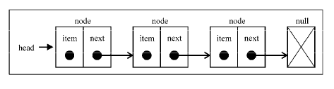

# 数据结构——单向链表
链表跟数组一样是线性的数据结构，区别在于数组在内存里是连续存在的，而链表不要求连续。链表是由一个一个的节点构成的，单向链表的节点是由存储的元素和指向下一个节点的引用组成  
  

## 优缺点
- 优点是数据的添加和删除不需要大规模迁移数据，效率高
- 缺点是获取某一元素的值麻烦，需要增加存储下一个节点引用的内存

## 方法接口
```js
class SingleLinkedList {
    append() {};
    insert() {};
    removeAt() {};
    remove() {};
    indexof() {};
    isEmpty() {};
    size() {};
    getHead() {};
    toString() {};
    print() {};
}
```

## 单向链表的具体实现
```js

class Node {
    constructor(element) {
        this.element = element;
        this.next = null;
    }
}

class SingleLinkedList {

    constructor() {
        this.head = null;
        this.length = 0;
    }

    // 添加元素到链表尾部
    append(element) {
        let node = new Node(element);
        let current = this.head;
        if (this.head === null){
            this.head = node;
        }else {
            while(current.next) {
                current = current.next;
            }
            current.next = node;
        }
        this.length++;
    };

    // 插入元素
    insert(position, element) {
        if (position >= 0 && position <= this.length) {
            const node = new Node(element);
            let index = 0;
            let current = this.head;
            let previous = null;
            if (position === 0) {
                this.head = node;
            }else {
                while (index++ < position){
                    previous = current;
                    current = current.next;
                }
                previous.next = node;
                node.next = current;
            }
            this.length++;
            return true;
        }
        return false;
    };

    // 移除指定位置的元素
    removeAt(position) {
        if (position >= 0 && position <= this.length) {
            let current = this.head;
            let previous = null;
            let index = 0;
            if (position === 0){
                node = this.head;
            }else {
                while (index++ < position){
                    previous = current;
                    current = current.next;
                }
                previous.next = current.next;
            }
            this.length--;
            return current.element;
        }
        return null;
    };

    // 寻找元素的下标
    indexof(element) {
        let current = this.head
        let index = -1
        while (current) {
            if (element === current.element) {
                return index + 1
            }
            index++
            current = current.next
        }
        return -1
    };

    // 移除某个元素
    remove(element) {
        const index = this.indexOf(element)
        return this.removeAt(index)
    };
    
    isEmpty() {
        return !this.length;
    };

    size() {
        return this.length;
    };

    getHead() {
        return this.head;
    };

    toString() {
        let current = this.head;
        let str = '';
        while (current) {
            str += current.element;
            current = current.next;
        }
        return str;
    };
}
```
