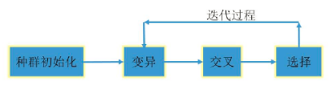
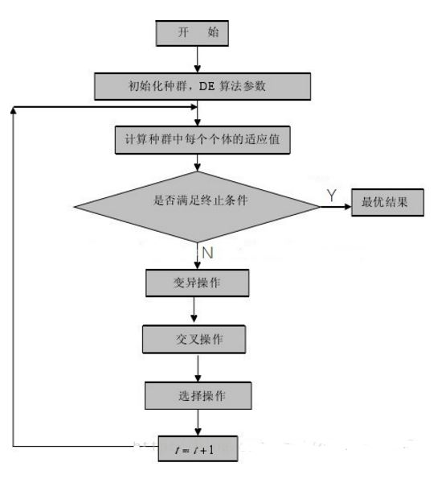

一、差分进化算法的介绍  
- 差分进化算法(Differential Evolution, DE)是一种基于群体差异的启发式随机搜索算法，将问题的求解表示成"染色体"的适者生存过程，通过"染色体"群的一代代不断进化，包括复制、交叉和变异等操作，最终收敛到"最适应环境"的个体，从而求得问题的最优解或满意解。
- 该算法是由R.Storn和K.Price为求解Chebyshev多项式而提出的。
- DE算法也属于智能优化算法，和ABC，PSO等类似，都属于启发式的优化算法。
- 本质上说，它是一种基于实数编码的具有保优思想的贪婪遗传算法。

最优化方法分为传统优化方法和启发式优化方法两大类。传统的优化方法大多数都是利用目标函数的导数求解；而启发式优化方法以仿生算法为主，通过启发式搜索策略实现求解优化。启发式搜索算法不要求目标函数连续、可微等信息，具有较好的全局寻优能力，成为最优化领域的研究热点。

二、差分演化算法中最重要的算子为差分变异算子

- 该算子将同一群体中两个个体向量进行差分和缩放，并与该群体中第三个个体向量相加等到一个变异个体向量；然后变异个体向量与父个体向量进行杂交形成尝试个体向量；最后，尝试个体向量与父个体向量进行适应值比较，较优者保存在下一代群体中。这样，差分演化算法利用差分变异，杂交和选择等算子对群体不断进行演化，直到达到终止条件退出。

三、流程
- 初始化种群
- 变异
- 交叉
- 选择

四、DE和GA的关系
- 差分进化算法相对于遗传算法而言，相同点都是通过随机生成初始种群，以种群中每个个体的适应度值为选择标准，主要过程也都包括变异、交叉和选择三个步骤。
- 不同之处在于遗传算法是根据适应度值来控制父代杂交，变异后产生的子代被选择的概率值，在最大化问题中适应值大的个体被选择的概率相应也会大一些。而差分进化算法变异向量是由父代差分向量生成，并与父代个体向量交叉生成新个体向量，直接与其父代个体进行选择。显然差分进化算法相对遗传算法的逼近效果更加显著。
- 差分进化算法类似遗传算法，包含变异、交叉、选择操作，淘汰机制，而差分进化算法与遗传算法不同之处，在于变异的部分是随选两个解成员变数的差异，经过伸缩后加入当前解成员的变数上，因此差分进化算法无须使用概率分布产生下一代解成员。

参考文章
- [python3 list comprehensions(列表解析)](https://docs.python.org/3/tutorial/datastructures.html#list-comprehensions)
- [连续函数微分与离散函数差分](https://blog.csdn.net/lz0499/article/details/71937737)
- [差分方程是解决计算机问题的重要的工具，离散数学是数学和计算机之间的桥梁](https://www.zhihu.com/question/38040913/answer/74954244)，找到了[离散数学及其应用](https://pic2.zhimg.com/v2-ecb056b8f5c6c9f7c4297dc2c7fbd313_r.jpg?source=1940ef5c)这本书  

- [优化算法——差分进化算法(DE)](https://blog.csdn.net/google19890102/article/details/41247753) 简单介绍了差分进化算法，用java语言实现了该算法
- [差分进化算法 (Differential Evolution)概述](https://www.omegaxyz.com/2018/04/24/differential_evolution_intro/)