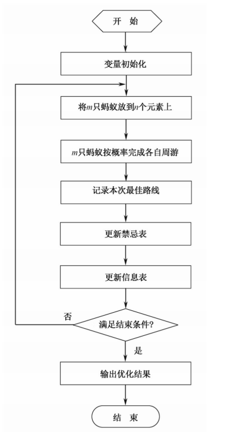

# Ant Colony Optimization (ACO)
## 简介
蚁群算法是模拟自然界蚂蚁的寻径方式而得出的一种仿生算法。蚂蚁运动过程中会留下信息素进行信息传递，某一路径上走过的蚂蚁越多，后来者选择该路径的概率越大，形成信息正反馈。（如果每只蚂蚁在单位距离留下的信息素相同，那对于较短路径上残留的信息素浓度就相对较高，这被后来的蚂蚁选择的概率就打，从而导致该路径上走的蚂蚁越来越多）

## 人工蚁群
- 把具有简单功能的工作单元看作蚂蚁。优先选择信息素浓度大的路径。
- 人工蚁群有一定的记忆能力。能够记忆已经访问过的节点。
- 人工蚁群选择下一条路径的时候按照一定算法规律有意识地寻找最优路径
- 信息素的更新方式：一是挥发，所有路径上的信息素以一定的比率减少，二是增强，给评价值“好”边增加信息素

## 人工蚂蚁与真实蚂蚁的相同点
- 一群相互协作的个体，通过同步/异步协作来寻找问题的最优解。单只蚂蚁可以构造出问题的解，多只蚂蚁协作才能发现问题的最优解
- 都使用信息素的迹和挥发机制，人工蚂蚁通过改变所访问过的问题的数字状态信息来进行简介的协作
- 以局部移动的方式构造出从原点到目的点之间的最短路径
- 都按照概率决策规则从一种状态转移到另一种相邻状态

## 不同点
- 人工蚂蚁具有内部状态，人工蚂蚁具有一定的记忆能力，能记住自己走过的地方
- 人工蚂蚁释放信息素的数量是其生成解的质量的函数

## 特点
- 本质上的并行算法
- 自组织算法
- 较强的鲁棒性
- 正反馈算法

## 基本蚁群算法
在算法的初始时刻，将m只蚂蚁随机地放到n个城市，同时将每只蚂蚁地禁忌表tabu地第一个元素设置为它当前所在的城市。此时各路径上的信息素量相等，设$\tau_{ij}(0)=c（c为一较小的常数）$，然后每只蚂蚁根据路径上残留的信息素量和启发式信息（两城市间的距离）独立地选择下一座城市，在时刻$t$，蚂蚁$k$从城市$i$转移到城市$j$地概率为:
$$p_{ij}^k(t)=
\begin{cases}
    \frac{[\tau_{ij}(t)]^\alpha \cdot [\eta_{ij}(t)]^\beta}
    {\displaystyle \sum_{s \in J_k(i)}{[\tau_{is}(t)]^\alpha \cdot [\eta_{is}]^\beta}}, \quad 当 j \in J_K(i)时 \\
    0, \qquad 其他
\end{cases}$$

$J_k(i)={1,2,...,n}-tabu_k$表示蚂蚁$k$下一步允许选择地城市集合  
$tabu_k$（禁忌表）记录了蚂蚁$k$当前走过的城市  
当所有城市都加入禁忌表$tabu_k$中时，蚂蚁$k$就完成了一次周游  
$\eta_{ij}$是一个启发式因子，表示蚂蚁从城市$i$转移到城市$j$地期望程度，通常取城市 $i$ 到城市 $j$ 之间距离的倒数  
$\alpha$ 和 $\beta$ 分别表示信息素和期望启发式因子的相对重要程度  
当所有蚂蚁完成一次周游后，个路径上的信息素会更新
$$\tau_{ij}(t+n)=(1-\rho) \cdot \tau_{ij}(t) + \Delta\tau_{ij}$$
$\rho(0<\rho<1)$表示路径上信息素的转给你发系数  
$1-\rho$表示信息素的持久性系数  
$\Delta\tau_{ij}$表示本次迭代中变$ij$上信息素的增量，即：
$$\Delta\tau_{ij}=\displaystyle \sum_{k=1}^m{\Delta\tau_{ij}^k}$$
$\Delta\tau_{ij}^k$ 表示第 $k$ 只蚂蚁在本次迭代中留在边 $ij$ 上的信息素量，如果蚂蚁 $k$ 没有经过该边，则为0，即：
$$\Delta\tau_{ij}^k=\begin{cases}
    \frac{Q}{L_k},\quad 当蚂蚁k在本次周游中经过边ij时 \\
    0,\quad 其他
\end{cases}$$
其中 $Q$ 为正常数，$L_k$ 表示第 $k$ 只蚂蚁在本次周游中所走过路径的长度

## 基本蚁群算法的流程
1. 参数初始化
2. 循环次数$N_c=N_c+1$
3. 蚂蚁的禁忌表索引号 $k=1$
4. 蚂蚁数目 $k=k+1$
5. 蚂蚁个体根据状态转移概率公式计算的概率选择元素 $j$ 前进，$j \in \{J_k(i)\}$
6. 修改禁忌表指针，即选择好之后将蚂蚁移动到新的元素，并把该元素移动到改蚂蚁个体的禁忌表中
7. 如集合 $C$ 中元素未便利完，即 $k<m$，则跳转到第4步，否则执行第8步
8. 记录本次最佳路线
9. 更细每条路径上的信息量
10. 若满足结束条件（循环次数 $N_c\geq G$ ），则循环结束并输出程序优化结果；否则青空禁忌表并跳转到第2步

