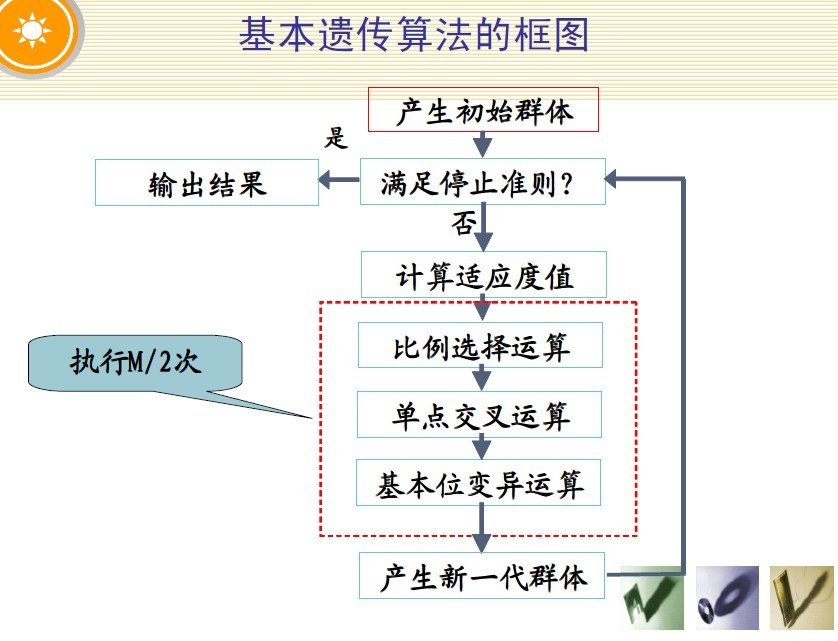

- 遗传算法概述：  
遗传算法是计算数学中用于解决最优化的搜索算法，是进化算法的一种。（进化算法最初是借鉴了进化生物学中的一些现象而发展起来的，这些现象包括遗传、突变、自然选择以及杂交等。）  
遗传算法是由美国的J. Holland教授于1975年在他的专著《自然界和人工系统的适应性》中首先提出的。  
借鉴生物界自然选择和自然遗传机制的随机化搜索算法。模拟自然选择和自然遗传过程中发生的繁殖、交叉和基因突变现象。  
在每次迭代中都保留一组候选解，并按某种指标从解群中选取较优的个体，利用遗传算子(选择、交叉和变异)对这些个体进行组合，产生新一代的候选解群，重复此过程，直到满足某种收敛指标为止。   
基本遗传算法（Simple Genetic Algorithms）又称简单遗传算法或标准遗传算法，是由Goldberg总结出的一种最基本的遗传算法，其遗传进化操作过程简单，容易理解，是其它一些遗传算法的雏形和基础。  
遗传算法通常实现方式为一种计算机模拟。对于一个最优化问题，一定数量的候选解（称为个体）的抽象表示（称为染色体）的种群向更好的解进化。传统上，解用二进制表示（即0和1的串），但也可以用其他表示方法。进化从完全随机个体的种群开始，之后一代一代发生。在每一代中，整个种群的适应度被评价，从当前种群中随机地选择多个个体（基于它们的适应度），通过自然选择和突变产生新的生命种群，该种群在算法的下一次迭代中成为当前种群。

- 基本遗传算法的组成  
（1）编码（产生初始种群）  
（2）适应度函数  
（3）遗传算子（选择、交叉、变异）  
（4）运行参数
1. 编码  
遗传算法（GA）通过某种编码机制把对象抽象为由特定符号按一定顺序排成的串。正如研究生物遗传是从染色体着手，而染色体则是由基因排成的串。基本遗传算法（SGA）使用二进制串进行编码。
2. 适应度函数   
遗传算法对一个个体（解）的好坏用适应度函数值来评价，适应度函数值越大，解的质量越好。
适应度函数是遗传算法进化过程的驱动力，也是进行自然选择的唯一标准，
它的设计应结合求解问题本身的要求而定。 
3. 遗传算子  
    3.1选择算子  
    遗传算法使用选择运算对个体进行优胜劣汰操作。
    适应度高的个体被遗传到下一代群体中的概率大；适应度低的个体，被遗传到下一代群体中的概率小。
    选择操作的任务就是从父代群体中选取一些个体，遗传到下一代群体。
    基本遗传算法（SGA）中选择算子采用轮盘赌选择方法。  
    3.2. 交叉算子  
    交叉运算，是指对两个相互配对的染色体依据交叉概率 Pc 按某种方式相互交换其部分基因，从而形成两个新的个体。
    交叉运算是遗传算法区别于其他进化算法的重要特征，它在遗传算法中起关键作用，是产生新个体的主要方法。  
    基本遗传算法（SGA）中交叉算子采用单点交叉算子。  
    3.3 变异算子  
    变异运算，是指改变个体编码串中的某些基因值，从而形成新的个体。
    变异运算是产生新个体的辅助方法，决定遗传算法的局部搜索能力，保持种群多样性。  
    交叉运算和变异运算的相互配合，共同完成对搜索空间的全局搜索和局部搜索。  
    基本遗传算法（SGA）中变异算子采用基本位变异算子。
    基本位变异算子是指对个体编码串随机指定的某一位或某几位基因作变异运算。  
    对于二进制编码符号串所表示的个体，若需要进行变异操作的某一基因座上的原有基因值为0，
    则将其变为1；反之，若原有基因值为1，则将其变为0。  
4. 运行参数  
（1）M ：种群规模  
（2）T ：遗传运算的终止进化代数   
（3）Pc：交叉概率  
（4）Pm：变异概率  
- 遗传算法的本质  
遗传算法本质上是对染色体模式所进行的一系列运算，即通过选择算子将当前种群中的优良模式遗传
到下一代种群中，利用交叉算子进行模式重组，利用变异算子进行模式突变。
通过这些遗传操作，模式逐步向较好的方向进化，最终得到问题的最优解。
- 遗传算法的应用  
（1）组合优化      （2）函数优化 （3）自动控制      （4）生产调度  
（5）图像处理      （6）机器学习 （7）人工生命      （8）数据挖掘

参考文章：
- [遗传算法详解](https://blog.csdn.net/u010451580/article/details/51178225)  
    了解了几个概念：
    + 适应度fitness： 度量某个物种对环境的适应程度
    + 选择selecttion：以一定的概率从种群中选择若干个个体。一般，选择过程是一种基于适应度的优胜劣汰的过程
    + 复制reproduction：细胞分裂时，遗传物质DNA通过复制而转移到新产生的细胞中，新细胞就继承了旧细胞的基因
    + 交叉crossover：两个染色体的某一相同位置处DNA被切断，前后两串分别交叉组合形成两个新的染色体。也称基因重组或杂交
    + 变异mutation：复制时可能（很小的概率）产生某些复制差错，变异产生新的染色体，表现出新的性状
    + 个体：指染色体带有特征的实体
    + 种群：个体的集合，该集合内个体数称为种群的大小
    + 初始种群：基本遗传算法（SGA）采用随机方法生成若干个个体的集合，该集合称为初始种群。
    + 初始种群中个体的数量称为种群规模。
    
    遗传算法的一般步骤：

    开始循环直至找到满意的解
    + 评估每条染色体所对应个体的适应度。
    + 遵照适应度越高，选择概率越大的原则，从种群中选择两个个体作为父方和母方。
    + 抽取父母双方的染色体，进行交叉，产生子代。
    + 对子代的染色体进行变异。
    + 重复2，3，4步骤，直到新种群的产生。

    结束循环。
    
    精髓是，淘汰掉那些适应度低的个体，保留适应度高的个体进行交叉

      
    
    遗传算法--进化论--物竞天择，适者生存  
    物竞--适应度函数：生物相互间的搏斗与及生物与客观环境的搏斗过程，在这里是用适应度函数来作为生存的标准  
    天择--选择函数：越适应的个体就越有可能繁殖后代。但是也不能说适应度越高的就肯定后代越多，只能是从概率上来说更多。需要有一种方式来选择可以生存繁殖的个体，这里有轮盘赌选择法和精英选择机制   
    遗传变异――基因重组（交叉）与基因突变  
    
    - 选择的作用：优胜劣汰，适者生存；  
    - 交叉的作用：保证种群的稳定性，朝着最优解的方向进化；  
    - 变异的作用：保证种群的多样性，避免交叉可能产生的局部收敛。
    
- [经典算法研究系列：七、深入浅出遗传算法](https://blog.csdn.net/v_JULY_v/article/details/6132775)  
July大神写的，深入浅出
- [遗传算法：基本原理及python实现](https://dothinking.github.io/blog/2018/10/21/%E9%81%97%E4%BC%A0%E7%AE%97%E6%B3%95-%E5%9F%BA%E6%9C%AC%E5%8E%9F%E7%90%86%E5%8F%8APython%E5%AE%9E%E7%8E%B0.html)
- [HELLO，遗传算法！](http://garfileo.is-programmer.com/2011/2/19/hello-ga.24563.html)  
用python详细的描述了算法的实现过程